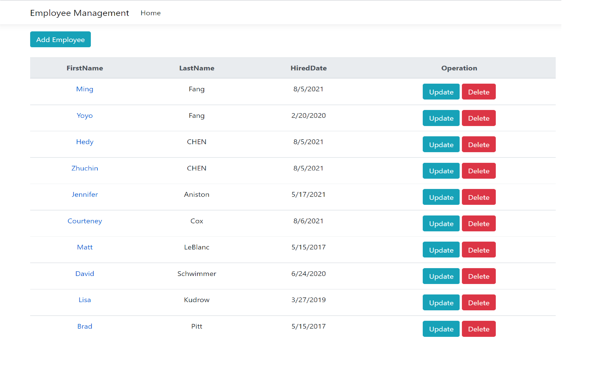
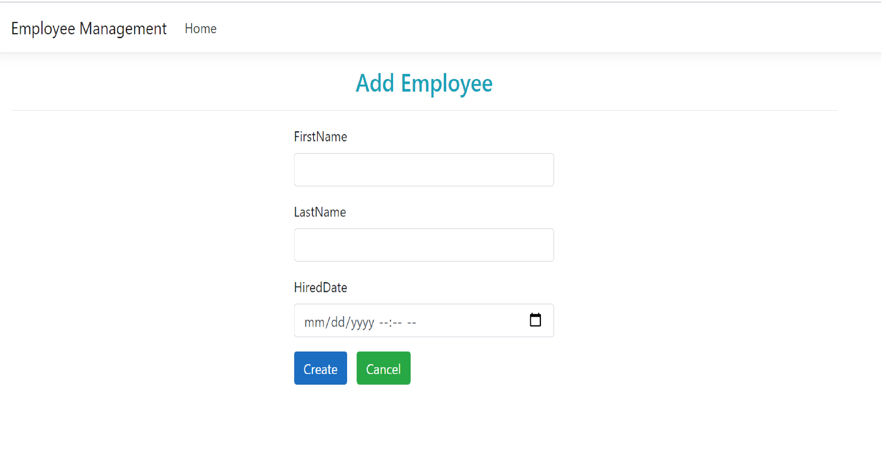
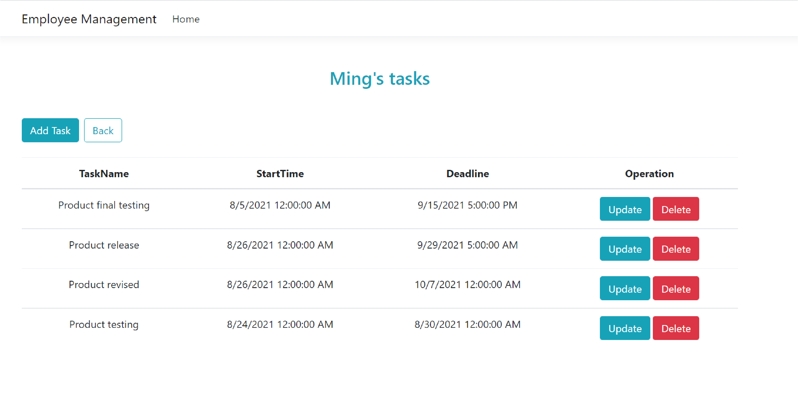
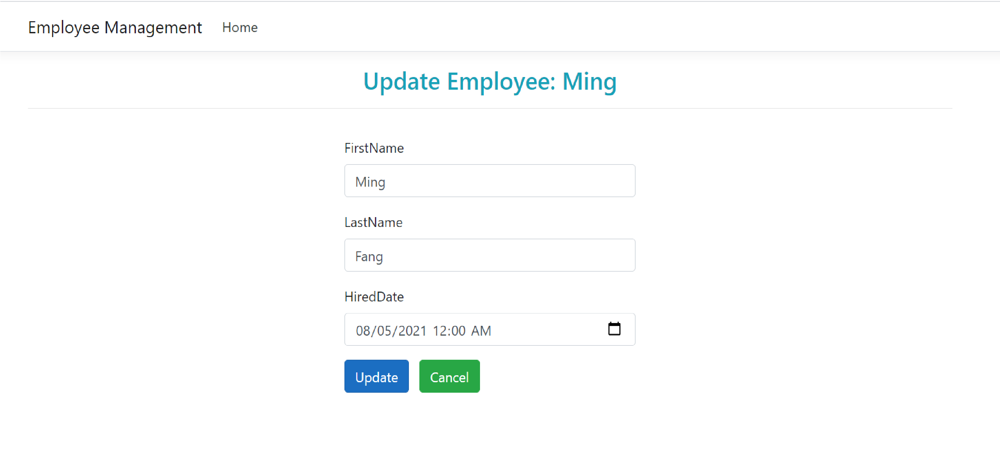
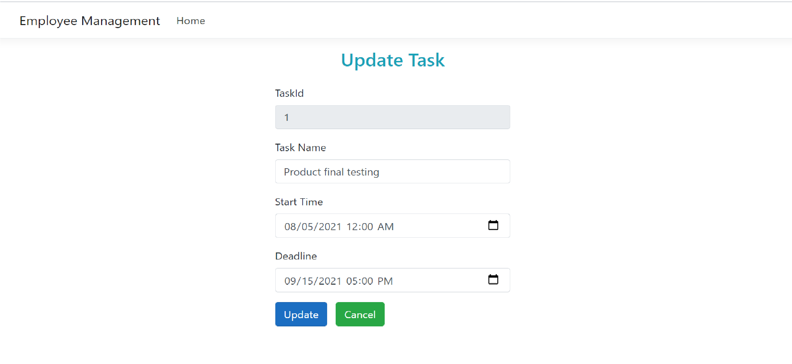

# Employee Management

The system stores information about the employee. I develop it with ASP .Net Core, and I connect it with the server by using Entity Framework Core. Also, I create and update database with EF Core Code First approach using migrations. The business logic was implemented to extract the correct data and presented in the client side. Also this website contains the webpages, decorated by the BOOTSTRAP.

<li>The home page displays the dashboard of the employees list.</li>
<li>The page will redirect to the page that displays all the tasks that are related to the Employee when cliking the employee name</li>

## Homepage 
### q

## Create Employee/Client/Interaction

## Update Task/ Employee

## Update/ Delete Interaction by Client

